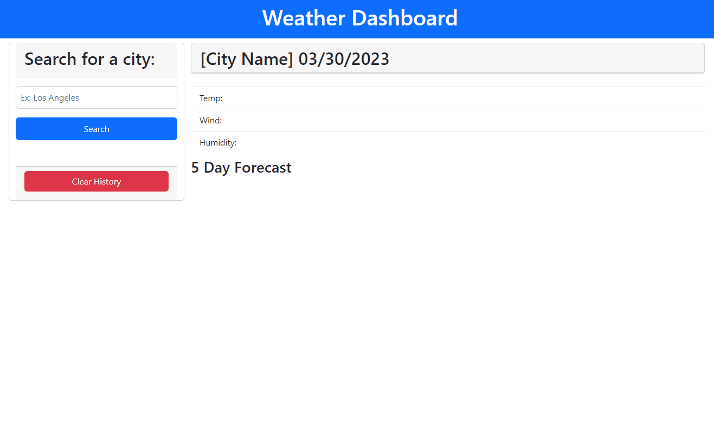

# Weather Dashboard

## Description
This weather dashboard was completed using HTML, Bootstrap CSS, and JavaScript with Jquery and DayJS. This application features a daily forecast and a 5 day forecast using the API from https://openweathermap.org/ .

## Installation
N/A

## Usage

## Credits
N/A

## License

N/A

## Features
* Searchable by global city names
* Previous search history stored for quick access
* Displays temperature, wind speeds, and humidity
* Displays both daily weather and a 5 day forecast
* Displays a small graphic for a visual of the weather
* Responsive for mobile use

## Deployed Application

https://b-reddington.github.io/weather-dashboard/
